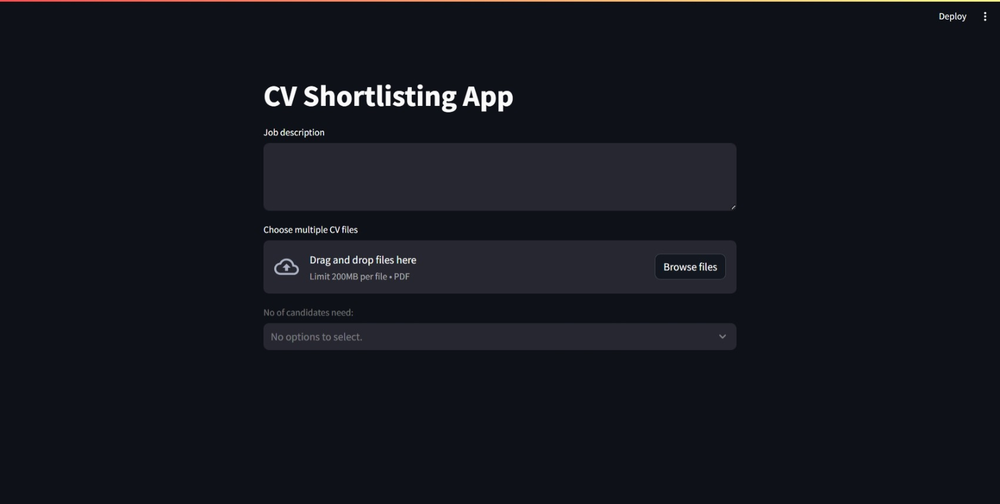

# CVMatcher: Streamlining Resume Shortlisting

## Introduction
This Streamlit application allows you to shortlist candidates based on their resumes (CVs) by comparing them to a provided job description. The app extracts relevant information from the CVs, computes a similarity score between each CV and the job description, and presents the top candidates based on this score.

## Installation
**Requirements** 
- Python 3.6 or later 
- pip (package installer for Python)  

**Steps** 
- Clone the repository
- Change the directory to the project folder
- Install the required packages

**Usage**
- Run the Streamlit app.
- Open the app in your browser by following the link displayed in the terminal.
- Provide the job description in the text area.
- Upload multiple CV files (in PDF format) using the file uploader.
- Select the number of candidates you want to shortlist.
- Click the "Extract Data" button.
- View the extracted data and the shortlisted candidates with their similarity scores.

## Model Information
The app uses the Sentence Transformers library with the 'all-MiniLM-L6-v2' pre-trained model for calculating the similarity scores between the job description and CVs.

## Notes
Ensure that the CVs are in PDF format for proper extraction of information.
The app displays the extracted data and the top candidates based on the similarity score.
The extracted data includes information such as Name, Email, Phone, LinkedIn, GitHub, Summary, Education, Internships, Professional Experience, Projects, Awards and Certifications, and Skills.

## Contribution Guidelines
We welcome contributions! Feel free to open issues, submit pull requests, or provide feedback.

Explore the code, contribute, and enhance your CV shortlisting process with CVMatcher!
